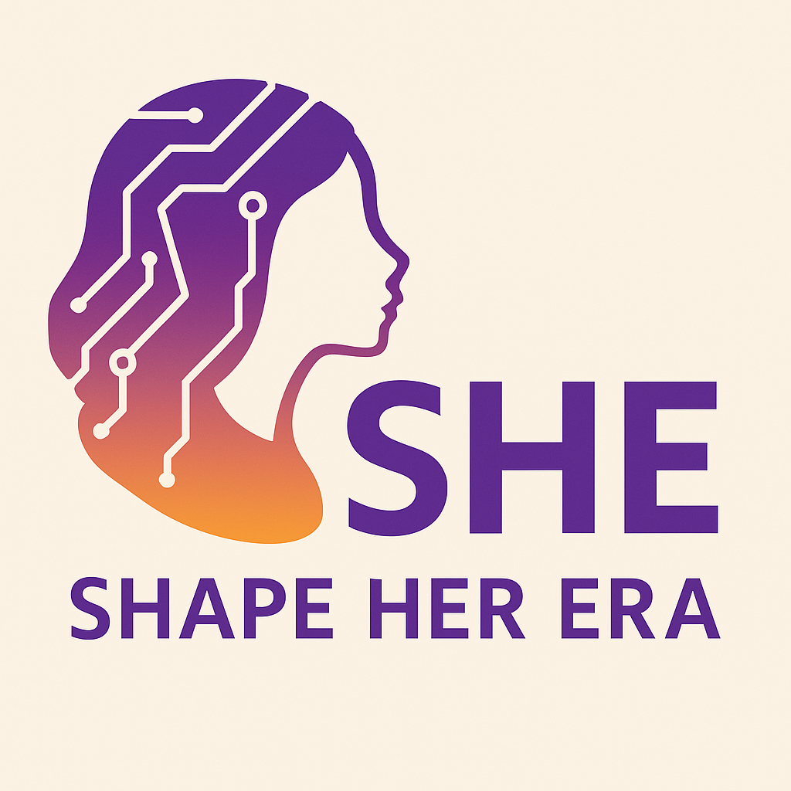

# SHE - Shape Her Era



Este projeto é parte da entrega parcial da **Certificadora 3** e foi desenvolvido com foco em promover e representar a presença feminina na tecnologia. O repositório contém todo o código necessário para executar e testar a aplicação localmente.

## Pré-requisitos

Para rodar este projeto, você precisará ter instalado em sua máquina:

- **Git** – Para clonar o repositório
- **Node.js (versão 20.00)** – Para instalar as dependências e executar a aplicação

## Clonando o Repositório

Primeiramente, abra o terminal ou prompt de comando e digite:

```bash
git clone https://github.com/AndreiRezende/certificadora3-SHE.git
